```
███████╗███████╗ ██████╗██╗   ██╗██████╗ ██╗████████╗██╗   ██╗
██╔════╝██╔════╝██╔════╝██║   ██║██╔══██╗██║╚══██╔══╝╚██╗ ██╔╝
███████╗█████╗  ██║     ██║   ██║██████╔╝██║   ██║    ╚████╔╝
╚════██║██╔══╝  ██║     ██║   ██║██╔══██╗██║   ██║     ╚██╔╝ 
███████║███████╗╚██████╗╚██████╔╝██║  ██║██║   ██║      ██║   
╚══════╝╚══════╝ ╚═════╝ ╚═════╝ ╚═╝  ╚═╝╚═╝   ╚═╝      ╚═╝   
                    iOS Security Tools
```

<p align="center">
  <a href="https://swift.org"></a>
  <a href="https://developer.apple.com/ios/"></a>
  <a href="https://swift.org/package-manager/"></a>
  <a href="LICENSE"></a>
</p>

<p align="center">
  <b>Production-ready security toolkit for iOS applications</b><br>
  <sub>Encryption • Keychain • Biometrics • Certificate Pinning • Secure Enclave</sub>
</p>

---

## 📋 Table of Contents

- [Security Features Matrix](#-security-features-matrix)
- [Security Architecture](#-security-architecture)
- [Installation](#installation)
- [Usage](#usage)
- [Documentation](#documentation)
- [Contributing](#contributing)
- [License](#license)
- [Star History](#-star-history)

---

## 🛡️ Security Features Matrix

| Feature | Description | iOS Version | Security Level |
|---------|-------------|:-----------:|:--------------:|
| **Keychain Services** | Secure credential & secret storage | iOS 2.0+ | 🔐 Hardware |
| **Biometric Auth** | Face ID / Touch ID integration | iOS 8.0+ | 🔐 Hardware |
| **AES-256 Encryption** | Symmetric encryption for data at rest | iOS 2.0+ | ⚡ Software |
| **RSA Encryption** | Asymmetric encryption for key exchange | iOS 2.0+ | ⚡ Software |
| **Certificate Pinning** | SSL/TLS man-in-the-middle protection | iOS 7.0+ | 🌐 Network |
| **Secure Enclave** | Hardware-isolated key operations | iOS 9.0+ | 🔒 Hardware |
| **JWT Handling** | Token generation & validation | iOS 13.0+ | 🎫 Token |
| **TOTP/HOTP** | Two-factor authentication codes | iOS 13.0+ | 🔑 2FA |

---

## 🔐 Security Architecture

```mermaid
graph TD
    subgraph User Layer
        A[👤 User Data]
        B[🔑 Credentials]
    end
    
    subgraph Security Layer
        C{AES-256<br/>Encryption}
        D[🔒 Keychain<br/>Services]
        E{Biometric<br/>Gate}
    end
    
    subgraph Hardware Layer
        F[💎 Secure<br/>Enclave]
        G[✅ Authorized<br/>Access]
        H[🚫 Access<br/>Denied]
    end
    
    A --> C
    B --> C
    C -->|Encrypted| D
    D --> E
    E -->|Face ID ✓| F
    E -->|Touch ID ✓| F
    E -->|Failed| H
    F --> G
    
    style A fill:#e1f5fe
    style B fill:#e1f5fe
    style C fill:#fff3e0
    style D fill:#e8f5e9
    style E fill:#fce4ec
    style F fill:#f3e5f5
    style G fill:#c8e6c9
    style H fill:#ffcdd2
```



---

## 📦 Installation

### Swift Package Manager

Add to your `Package.swift`:

```swift
dependencies: [
    .package(url: "https://github.com/muhittincamdali/iOSSecurityTools.git", from: "1.0.0")
]
```

Or in Xcode: **File → Add Package Dependencies** → paste the URL.

---

## 🚀 Quick Start

```swift
import iOSSecurityTools

// Initialize
let security = iOSSecurityTools.shared
security.initialize()

// Check security status
let status = security.getSecurityStatus()
print("Biometrics available: \(status.biometricAvailable)")
print("Keychain ready: \(status.keychainAvailable)")
```

---

## 📚 Features & Examples

### 🔒 Keychain Services

Store sensitive data securely in the iOS Keychain with hardware-backed encryption.

```swift
let keychain = KeychainManager.shared

// Save with automatic encryption
try keychain.save("api_secret_token_xyz", forKey: "apiToken")

// Retrieve securely
if let token: String = try keychain.get(forKey: "apiToken") {
    print("Token retrieved")
}

// Save with biometric protection
try keychain.save(
    sensitiveData,
    forKey: "protectedSecret",
    accessibility: .whenPasscodeSetThisDeviceOnly,
    flags: [.biometryCurrentSet]
)

// Delete when done
try keychain.delete(forKey: "apiToken")
```

### 🔐 AES-256 Encryption

Military-grade symmetric encryption for data at rest.

```swift
let aes = AESEncryption.shared

// Generate a secure 256-bit key
let key = aes.generateKey(bits: 256)

// Encrypt sensitive data
let plaintext = "Social Security: 123-45-6789"
let encrypted = try aes.encrypt(plaintext.data(using: .utf8)!, with: key)

// Decrypt when needed
let decrypted = try aes.decrypt(encrypted, with: key)
let original = String(data: decrypted, encoding: .utf8)
```

### 👆 Biometric Authentication

Seamless Face ID and Touch ID integration.

```swift
let biometrics = BiometricAuth.shared

// Check what's available
switch biometrics.biometricType {
case .faceID:
    print("Face ID ready")
case .touchID:
    print("Touch ID ready")
case .none:
    print("Fallback to passcode")
}

// Authenticate user
biometrics.authenticate(reason: "Access your vault") { result in
    switch result {
    case .success:
        self.unlockSensitiveContent()
    case .failure(let error):
        self.handleAuthError(error)
    }
}

// Modern async/await
func authenticateUser() async throws -> Bool {
    return try await biometrics.authenticate(reason: "Verify your identity")
}
```

### 🌐 Certificate Pinning

Protect against man-in-the-middle attacks.

```swift
// Configure pinned certificates
let pins = CertificatePins(
    domain: "api.yourapp.com",
    hashes: [
        "sha256/AAAAAAAAAAAAAAAAAAAAAAAAAAAAAAAAAAAAAAAAAAA=",
        "sha256/BBBBBBBBBBBBBBBBBBBBBBBBBBBBBBBBBBBBBBBBBBB="
    ]
)

// Create pinned session
let session = PinnedURLSession(pins: [pins])

// All requests are now protected
let (data, response) = try await session.data(from: apiURL)
```

### 🎫 JWT Token Management

Generate and validate JSON Web Tokens.

```swift
let jwt = JWTManager.shared

// Create a signed token
let payload = JWTPayload(
    sub: "user_12345",
    exp: Date().addingTimeInterval(3600),
    customClaims: ["role": "admin"]
)
let token = try jwt.sign(payload, algorithm: .hs256, secret: signingKey)

// Validate incoming tokens
let verified = try jwt.verify(incomingToken, secret: signingKey)
if verified.isExpired {
    throw AuthError.tokenExpired
}
```

### 🔑 TOTP Two-Factor Authentication

Generate time-based one-time passwords compatible with Google Authenticator.

```swift
let otp = OTPGenerator.shared

// Generate secret for new user
let secret = otp.generateSecret()
// Store this in Keychain, show QR code to user

// Generate current TOTP code
let code = otp.generateTOTP(secret: secret)
print("Current code: \(code)") // "847293"

// Verify user-entered code
let isValid = otp.verify(code: userInput, secret: secret)
```

### 🔒 Secure Enclave

Hardware-isolated cryptographic operations (iPhone 5s+).

```swift
let enclave = SecureEnclaveManager.shared

// Generate key pair inside Secure Enclave
// Private key NEVER leaves the hardware
let keyPair = try enclave.generateKeyPair(
    tag: "com.app.signing",
    accessControl: .biometryAny
)

// Sign data with hardware-protected key
let signature = try enclave.sign(
    data: documentHash,
    keyTag: "com.app.signing"
)

// Verify signature
let isValid = try enclave.verify(
    signature: signature,
    for: documentHash,
    keyTag: "com.app.signing"
)
```

### 📁 Secure File Storage

Encrypted file storage with automatic key management.

```swift
let storage = SecureStorage.shared

// Save encrypted file
let document = sensitiveDocument.data(using: .utf8)!
try storage.save(document, filename: "medical_records.enc")

// Read and decrypt
let decrypted = try storage.load(filename: "medical_records.enc")

// Secure delete (overwrites before deletion)
try storage.secureDelete(filename: "medical_records.enc")
```

### 🔍 Security Audit

Runtime security scanning and jailbreak detection.

```swift
let scanner = SecurityScanner.shared

// Run comprehensive audit
let audit = try await scanner.performAudit()

// Check results
if audit.isJailbroken {
    // Device compromised - restrict sensitive features
    disableSensitiveOperations()
}

if audit.debuggerAttached {
    // Potential reverse engineering attempt
    logSecurityEvent(.debuggerDetected)
}

// Check all vulnerabilities
for vulnerability in audit.vulnerabilities {
    print("⚠️ \(vulnerability.severity): \(vulnerability.description)")
}
```

---

## 🏗️ Architecture

```
iOSSecurityTools/
├── Sources/
│   ├── Authentication/
│   │   ├── BiometricAuth.swift      # Face ID / Touch ID
│   │   ├── JWTManager.swift         # JWT handling
│   │   ├── OTPGenerator.swift       # TOTP/HOTP codes
│   │   └── OAuthManager.swift       # OAuth 2.0 flows
│   ├── Encryption/
│   │   └── AESEncryption.swift      # AES-256-GCM
│   ├── KeyManagement/
│   │   ├── KeychainManager.swift    # Keychain wrapper
│   │   ├── KeyGenerator.swift       # Secure key generation
│   │   ├── KeyRotation.swift        # Automatic rotation
│   │   └── CertificateManager.swift # Cert pinning
│   ├── SecureStorage/
│   │   ├── SecureStorage.swift      # Encrypted files
│   │   └── FileEncryption.swift     # File-level crypto
│   ├── SecurityMonitoring/
│   │   ├── SecurityScanner.swift    # Jailbreak detection
│   │   └── AuditLogger.swift        # Security logging
│   └── Core/
│       └── iOSSecurityTools.swift   # Main interface
├── Examples/
│   └── SecurityDemo/                # Sample app
├── Tests/
│   └── iOSSecurityToolsTests/       # Unit tests
└── Documentation/                   # DocC docs
```

---

## ✅ Security Best Practices

### Do's ✓

| Practice | Implementation |
|----------|----------------|
| **Store secrets in Keychain** | Never use `UserDefaults` for sensitive data |
| **Use Secure Enclave** | Hardware-protect signing keys on supported devices |
| **Implement cert pinning** | Prevent MITM attacks on API calls |
| **Enable data protection** | Use `.completeFileProtection` for sensitive files |
| **Salt password hashes** | Use unique salts with bcrypt/Argon2 |
| **Rotate keys periodically** | Implement automatic key rotation |
| **Log security events** | Audit trail for compliance |

### Don'ts ✗

| Anti-Pattern | Risk |
|--------------|------|
| ❌ Hardcoded API keys | Extracted via reverse engineering |
| ❌ HTTP for sensitive data | Traffic interception |
| ❌ MD5/SHA1 for passwords | Rainbow table attacks |
| ❌ Ignoring jailbreak status | Bypassed security controls |
| ❌ Long-lived tokens | Extended attack window |
| ❌ Disabled ATS | No transport security |

---

## 🔒 Data Flow


---

## 📋 Requirements

| Requirement | Minimum |
|-------------|---------|
| iOS | 15.0+ |
| Xcode | 15.0+ |
| Swift | 5.9+ |
| Secure Enclave | iPhone 5s+ (A7 chip) |

---

## 🧪 Testing

```bash
# Run all tests
swift test

# Run with coverage
swift test --enable-code-coverage

# Test specific module
swift test --filter KeychainTests
```

---

## 📖 Documentation

Full documentation available in the `Documentation/` folder:

- [Encryption Guide](Documentation/EncryptionGuide.md)
- [Keychain Best Practices](Documentation/KeychainGuide.md)
- [Biometric Integration](Documentation/BiometricGuide.md)
- [Certificate Pinning Setup](Documentation/CertPinningGuide.md)
- [Security Audit Guide](Documentation/SecurityAuditGuide.md)

---

## 🤝 Contributing

Contributions welcome! Please read [CONTRIBUTING.md](CONTRIBUTING.md) first.

1. Fork the repository
2. Create feature branch (`git checkout -b feature/amazing-feature`)
3. Commit changes (`git commit -m 'feat: add amazing feature'`)
4. Push to branch (`git push origin feature/amazing-feature`)
5. Open a Pull Request

---

## 📄 License

MIT License - see [LICENSE](LICENSE) for details.

---

## 👨‍💻 Author

**Muhittin Camdali**

[](https://github.com/muhittincamdali)
[](https://github.com/muhittincamdali/iOSSecurityTools/actions)[](https://linkedin.com/in/muhittincamdali)
[](https://github.com/muhittincamdali/iOSSecurityTools/actions)
---

<p align="center">
  <sub>Built with security in mind 🛡️</sub>
</p>

---

## 📈 Star History

<a href="https://star-history.com/#muhittincamdali/iOSSecurityTools&Date">
 <picture>
   <source media="(prefers-color-scheme: dark)" srcset="https://api.star-history.com/svg?repos=muhittincamdali/iOSSecurityTools&type=Date&theme=dark" />
   <source media="(prefers-color-scheme: light)" srcset="https://api.star-history.com/svg?repos=muhittincamdali/iOSSecurityTools&type=Date" />
   
 </picture>
</a>
